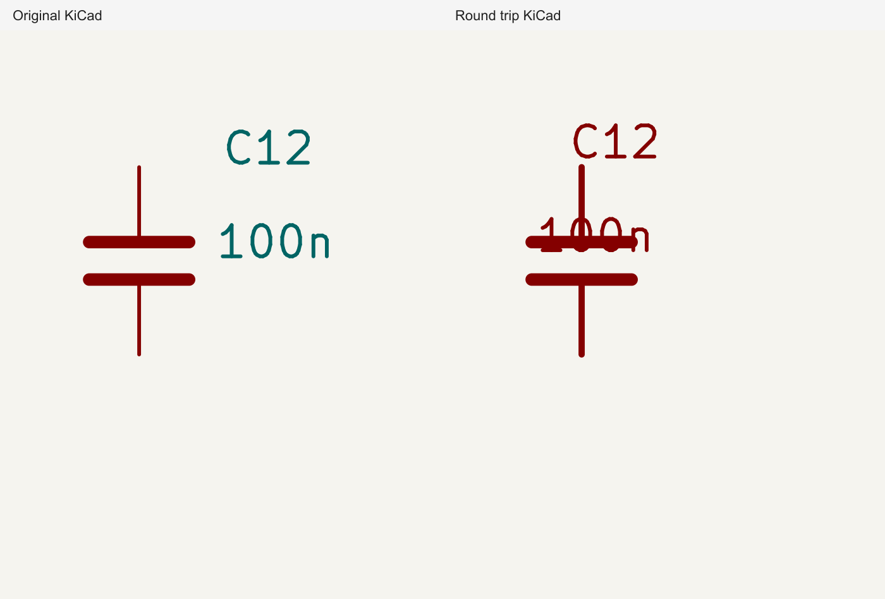

# V02: Arduino C12 field justification

This fixture retains only the original `Device:C` library symbol and C12 instance
from [Arduino-Uno-R3-PCB-Design](https://github.com/daviddzekwer/Arduino-Uno-R3-PCB-Design/tree/cc11949e6205e757a8a8fdc65092ab99e8a60bfb).
Source commit: `cc11949e6205e757a8a8fdc65092ab99e8a60bfb`.
The symbol position, 180-degree angle, field positions, font sizes and right
justifications are unchanged. Other circuit items are removed to isolate V02.



KiCad displays the source right-justified properties as left-anchored readable
text after applying the symbol orientation. The importer retains the raw
`right` justification, so C12 and 100n extend left across the capacitor instead.
The desired anchor assertion is marked `test.failing` on the repro branch; the
fix layer will make it an ordinary regression test.

## Reproduce

```sh
bun install
bun test tests/repros/v02-arduino-capacitor-labels/v02-arduino-capacitor-labels.test.ts
bun tests/repros/v02-arduino-capacitor-labels/render.ts
```

The renderer requires native KiCad CLI 10.0.6 (tested version), or set `KICAD_CLI`
to its absolute path. Both panels use that same native renderer and equal crops,
not a Circuit JSON preview. Export is pinned to `circuit-json-to-kicad@0.0.230`.
Explicit A3 dimensions and the original coordinate origin remove global page
translation from the comparison. Generated intermediate JSON, round-trip
schematic and native SVG files are written to ignored `out/` for inspection.
`polygon-clipping` is supplied as a dev dependency because the pinned exporter
imports it without declaring it as a runtime dependency.

This reproduction isolates label placement. Field colors and unrelated defaults
are separate audit findings and are not part of V02.
